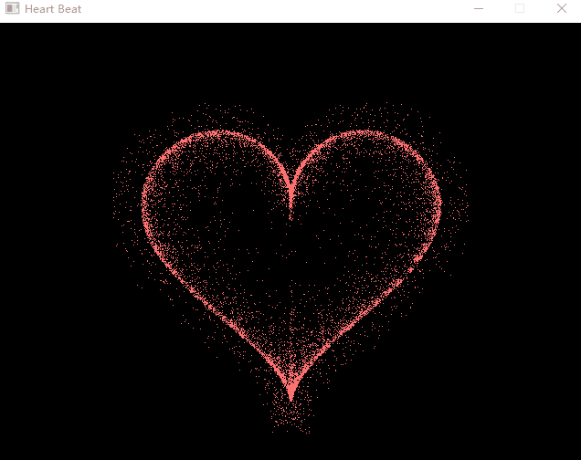

# 效果

https://user-images.githubusercontent.com/37768049/201472320-1d7676cb-0916-4cd5-821d-2a42bcc40e63.mp4

使用左右箭头可以控制边界粒子的浓密，使用上下箭头可以控制内部粒子的浓密。

视频展示：https://www.bilibili.com/video/BV1PY411f7ii/?vd_source=82818513a8e58a944246988169750753
